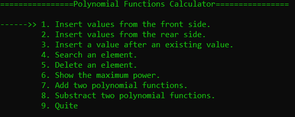
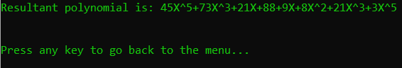
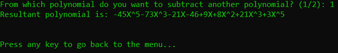
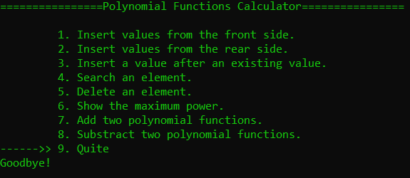

# 
Polynomial Representation using Linked List

This CLI based application can do several operations. 

1. Insert values from front
2. Insert values from rear
3. Insert a value after an existing value.
4. Search an element.
5. Delete an element.
6. Show the maximum power.
7. Add two polynomial functions.
8. Substract two polynomial functions.

## Screenshots of the Application

### Menu

 

### Insert from Front

 

### Insert from Rear

 

### Maximum Power

 

### Addition of two polynomials

 

### Substraction of two polynomials

 

### Quite

